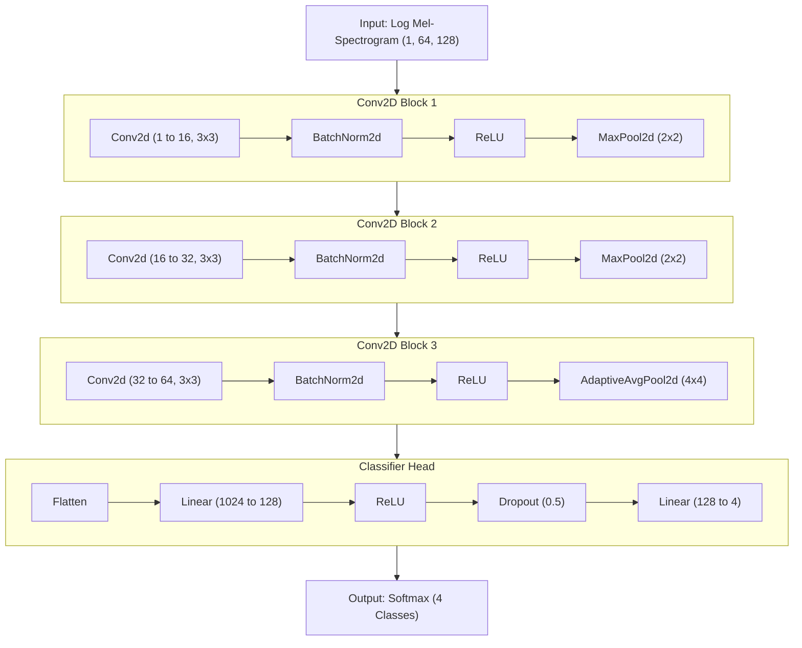

# Spectral Fingerprints: Classifying and Comparing Human Beatbox Sounds to Mechanical Percussion

**A Digital Signal Processing and Machine Learning Study of Vocal Percussion**

---

**Author:** Zhou Xingye
**Supervisor:** Tan Dayang
**Date:** April 2026
**Module:** Independent Study Component (ISC)

---

## Abstract

Human beatboxing — the vocal art of imitating percussion instruments — has attracted growing interest in music information retrieval, yet existing research rarely asks how acoustically similar beatbox sounds actually are to the real instruments they imitate. This study investigates the spectral fingerprints of four fundamental beatbox sounds — the bass kick `{b}`, the K-snare click `{k}`, the push hi-hat `{psh}`, and the neutral hum `{nu}` — recorded from nine amateur participants. A two-phase pipeline was developed: Phase 1 applied unsupervised peak-alignment clustering to achieve a 76.1% classification baseline, while Phase 2 trained three supervised models — a Support Vector Machine (SVM), a Random Forest, and a Convolutional Neural Network (CNN) on mel-spectrograms — evaluated with Leave-One-Participant-Out (LOPO) cross-validation. The CNN achieved 94.2% overall accuracy, reducing errors from 21 to 5. Key findings show that MFCC features are decisive for resolving the `b`/`k` acoustic ambiguity, and that individual differences in vocal production — not model architecture — constitute the primary barrier to perfect generalisation. These results establish a reliable classification foundation upon which a future Acoustic Realism Score can quantify the spectral distance between beatbox sounds and their instrument counterparts.

---

## 1. Introduction

Beatboxing is the vocal art of producing percussion sounds using only the human mouth, lips, tongue, and vocal folds. From Rahzel's pioneering recordings in the 1990s to contemporary performers who reproduce entire drum kits vocally, beatboxers have long demonstrated a remarkable capacity to create the perceptual *illusion* of mechanical percussion using biological instruments. The three foundational sounds of the art form — the bass kick `{b}`, the hi-hat `{t}` or `{psh}`, and the snare `{K}` or `{k}` — form the rhythmic vocabulary of virtually every beatbox performance worldwide (Stowell & Plumbley, 2008).

Yet despite this cultural prominence, the academic literature on beatboxing remains narrowly focused. Two threads dominate: classification for transcription — converting beatbox audio to MIDI notation — and physiological articulation studies using real-time MRI to map vocal tract configurations (Proctor et al., 2013). What is almost entirely absent is any quantitative investigation of how *acoustically similar* a beatbox sound is to the real instrument it attempts to imitate. A vocal kick drum may produce a convincing rhythm, but how close is it, spectrally, to an actual kick drum? Where does the acoustic illusion hold, and where does it break?

This distinction matters for at least two applied domains. In **Human-Computer Interaction (HCI)**, beatbox interfaces allow users to control software synthesisers, DAWs, and robotic instruments through voice. Reliable classification is a prerequisite for such systems, but a measure of *acoustic realism* — how faithfully the voice reproduces the target instrument — could drive adaptive synthesis pipelines that narrow the gap between vocal output and mechanical sound. In **generative audio modelling**, understanding which spectral parameters create the perception of a real drum could improve voice-to-drum synthesis, enabling applications for accessible music production where physical instruments are unavailable.

This study was conducted in two phases. **Phase 1** established a baseline by applying an unsupervised peak-alignment clustering pipeline to a dataset of 88 beatbox recordings from nine participants, achieving 76.1% classification accuracy. **Phase 2** moved to supervised classification, training an SVM, Random Forest, and CNN with LOPO cross-validation to test genuine generalisation across individuals. The CNN achieved 94.2% accuracy — reducing total errors from 21 to 5.

Two research questions guide the study:

- **RQ1:** Can machine learning reliably classify beatbox sounds across different individuals?
- **RQ2:** What acoustic features are most discriminative, and where do beatbox sounds spectrally diverge from their instrument counterparts?

Phase 2 conclusively answers RQ1 in the affirmative. The analysis of feature importance and error patterns begins to address RQ2, revealing that individual vocal differences — not limitations of current ML models — represent the central frontier for future work.

---

## 2. Related Work

The earliest computational study of beatboxing at scale is Stowell and Plumbley's 2008 technical report, which characterised the acoustic properties of the three primary sounds and proposed the `{b}`, `{t}`, `{K}` taxonomy that has since become standard in the field. Their work established that beatbox sounds share temporal envelope characteristics with real drums but that their spectral content is shaped by the human vocal tract, producing formant patterns absent in mechanical percussion. This foundational observation directly motivates the present study's focus on formant-capturing features (MFCCs).

Sinyor and McKay (2005) applied the ACE feature extraction framework to beatbox classification at ISMIR, achieving reasonable accuracy on a small dataset but relying on features not specifically designed for percussive sounds. Their work motivates the hypothesis — validated in Phase 1 of this study — that generic audio features are insufficient for fine-grained beatbox discrimination, particularly between the `b` and `k` sounds.

Kapur, Benning and Tzanetakis (2004) demonstrated a practical application of beatbox classification in a music retrieval system ("Query-by-Beat-Boxing"), using user-performed rhythms as database queries. This application layer reinforces the practical importance of robust classification: retrieval systems fail when the underlying recogniser cannot distinguish basic sound categories reliably.

The physiological work of Proctor et al. (2013), using real-time MRI to image the vocal tract during beatboxing, provides crucial mechanistic context for this study's feature choices. Their findings show that each beatbox sound type involves a distinct vocal tract configuration — the bass `{b}` is produced by a labial plosive with a relaxed, open tract; the `{K}` snare involves a velar closure; hi-hat fricatives require a narrow turbulent constriction. These configurations produce different formant structures, which are the acoustic correlates of MFCCs. This mechanistic grounding explains precisely why MFCC features transformed the `b` accuracy from 38.1% (Phase 1) to 90.0% (Phase 2) — MFCCs encode formant information, and formants distinguish the vocal tract shapes of `b` from `k`.

Martanto and Kartowisastro (2025), in the most recent comparable study, applied machine learning to beatbox classification and achieved accuracies in a broadly similar range to Phase 2. Their study is notable for its industry-facing framing and use of diverse participant pools, complementing this study's more granular per-participant analysis. The present work differs in its explicit use of LOPO cross-validation — a more stringent test of generalisation than random train-test splits — and in its dual-phase design that traces the contribution of individual methodological improvements.

The model architecture of Phase 2's CNN draws on the tradition established by Chou et al. (IJCAI, 2018) and related instrument recognition CNN studies (Hung & Yang, 2018). These works treat mel-spectrograms as 2D images for convolutional learning, using progressively deeper feature maps to detect spectral patterns at increasing levels of abstraction. The present adaptation scales this approach to a small dataset (86 samples) through data augmentation and architectural simplification.

What remains absent across all this literature is a direct, quantitative comparison of the acoustic features of beatbox sounds to those of the mechanical instruments they imitate. This study's proposed Acoustic Realism Score — cosine similarity between beatbox and instrument MFCC feature centroids — would fill this gap, and Phase 2's classification results make this comparison technically feasible.

---

## 3. Dataset

The dataset was assembled from 9 amateur participants, identified by numeric IDs (1, 2, 3, 4, 5, 7, 8, 10, 11). Each participant was recorded producing four vocal percussion sounds in a non-studio, self-recorded environment:

| Label | Sound | Acoustic Description |
|---|---|---|
| `b` | Bass / Vocal Kick | Low-frequency labial plosive — imitates the kick drum |
| `k` | K-Snare / Click | Velar stop consonant snap — imitates the snare or rim shot |
| `psh` | Push Hi-hat | Sustained fricative noise — imitates closed or open hi-hat |
| `nu` | Neutral Hum | Sustained resonant tone — a sustained tonal beatbox sound |

Files are stored under `audio_data/{participant_id}/Phase 1/` with the naming convention `{participant}-{sound}-{take}.wav`. The total corpus consists of **88 audio files** (.wav format) across the four categories. Phase 2 excluded 2 files that were too short for reliable MFCC extraction (fewer than 256 samples at 22,050 Hz), yielding an effective dataset of **86 samples**: b=20, k=22, nu=20, psh=24.

The recording conditions were not controlled — participants used personal recording devices in home environments, producing clips of varying length, signal-to-noise ratio, and onset position. This variability introduced several engineering challenges that proved central to the design of the Phase 1 pipeline (see Appendix B for a detailed account).

The dataset is notable for its individual differences. Participants vary in their production technique, vocal tract anatomy, experience level, and the recording equipment used. As documented across both phases, this individual variation is the dominant source of misclassification — a finding that has direct implications for any real-world deployment of beatbox classification systems.

---

## 4. Methodology

### 4.1 Phase 1 — Unsupervised Clustering via Peak-Aligned Time-Series Features

Phase 1 was motivated by the desire to establish whether beatbox sounds are acoustically separable *without* any labelled training data. The full pipeline, implemented in `peak_alignment_clustering.py`, proceeds through four stages:

```
Raw Audio (.wav)
       │
 [Feature Extraction]
  Spectral Centroid, RMS Energy, Noisiness (time-series per clip)
       │
 [Peak Alignment]
  All clips anchored at their energy peak — fixed 151-frame window
       │
 [Overlap Distance Matrix]
  Pairwise IoU overlap of aligned time-series → 88×88 distance matrix
       │
 [K-Means Clustering]
  4 clusters mapped to sound types by majority vote
```

#### 4.1.1 Feature Extraction

Three time-series features are extracted from each audio clip using `librosa`:

**Spectral Centroid** measures the "centre of mass" of the frequency spectrum at each frame — the weighted average frequency where most energy is concentrated:

$$C(t) = \frac{\sum_n f_n \cdot |X_t(n)|}{\sum_n |X_t(n)|}$$

A high centroid indicates a bright, high-frequency sound (`psh`, `k`); a low centroid indicates a dark, bassy sound (`b`, `nu`).

**RMS Energy** quantifies the instantaneous loudness per frame:

$$E_\text{RMS}(t) = \sqrt{\frac{1}{N}\sum_{n=0}^{N-1} y(n)^2}$$

The energy time-series describes the amplitude envelope — the characteristic attack, sustain, and decay profile that makes a kick drum sound different from a hi-hat even in the absence of pitch information.

**Noisiness** is derived through Harmonic-Percussive Source Separation (HPSS), decomposing the signal into harmonic `y_harm` and percussive `y_perc` components. The noisiness ratio is:

$$\text{Noisiness}(t) = \frac{\text{RMS}\left(y_\text{perc}\right)(t)}{\text{RMS}(y)(t) + \epsilon}$$

Values near 1 indicate aperiodic, noisy sounds (fricatives like `psh`); values near 0 indicate periodic, tonal sounds (`nu`).

#### 4.1.2 Peak Alignment

Raw clips vary in length and the sound event may start at different positions within the file. Comparing unaligned time-series measures timing offset rather than acoustic character. Peak alignment addresses this by anchoring all signals at their moment of maximum RMS energy: the peak index is found via `np.argmax(energy_series)`, and a fixed window of 50 frames before and 100 frames after is extracted, producing a 151-frame aligned vector per feature.

This approach has a known limitation: the single-peak assumption fails for sounds with a gradual energy profile (`nu`) or a pre-plosive noise burst (`b`). The fixed window size also forces sounds of fundamentally different temporal scales into the same representation.

#### 4.1.3 Overlap Distance

For each pair of samples, the similarity of their aligned time-series is measured using an area-of-intersection over area-of-union (IoU) metric applied to 1D time-series:

$$\text{Overlap}(s_1, s_2) = \frac{\sum_t \min(s_1(t), s_2(t))}{\sum_t \max(s_1(t), s_2(t))} \times 100$$

The three feature overlaps (centroid, energy, noisiness) are averaged, and the distance is defined as $D(i,j) = 100 - \text{mean overlap}$. This produces an 88×88 pairwise distance matrix used as input to clustering.

#### 4.1.4 K-Means Clustering

K-means (`n_clusters=4`) is applied to the distance matrix, with cluster-to-sound mapping determined by majority vote. A geometric limitation applies: K-means minimises within-cluster Euclidean variance and is better suited to raw feature matrices than pairwise distance matrices. Spectral clustering or DBSCAN would be more appropriate for this input format, and this mismatch contributes to the suboptimal clustering found in Phase 1 results.

---

### 4.2 Phase 2 — Supervised Classification

Phase 2, implemented in `phase2_classification.py`, moves from unsupervised clustering to fully supervised classification with three models — SVM, Random Forest, and CNN — all evaluated under Leave-One-Participant-Out (LOPO) cross-validation.

#### 4.2.1 Feature Engineering — 38-Dimensional Feature Vector

Each audio clip is summarised as a 38-dimensional feature vector. All features are computed using `librosa` at a sample rate of 22,050 Hz, frame size of 2,048 samples (≈93 ms), and hop length of 512 samples (≈23 ms).

| # | Feature | Dims | What it captures |
|---|---|---|---|
| 1–13 | MFCC Mean | 13 | Spectral envelope shape / vocal tract formants |
| 14–26 | MFCC Std | 13 | Temporal variability of timbre across the clip |
| 27–28 | Spectral Centroid (mean + std) | 2 | Overall brightness and its temporal drift |
| 29–30 | Spectral Rolloff (mean + std) | 2 | Upper boundary of spectral energy concentration |
| 31–32 | Spectral Flux (mean + std) | 2 | Rate of frame-to-frame spectral change |
| 33–34 | Zero-Crossing Rate (mean + std) | 2 | Noisiness and implicit pitch height |
| 35–36 | RMS Energy (mean + std) | 2 | Overall loudness and amplitude dynamics |
| 37 | Attack Time | 1 | Duration from detected onset to energy peak |
| 38 | Decay Rate | 1 | Linear slope of RMS after energy peak |
| | **Total** | **38** | |

**Mel-Frequency Cepstral Coefficients (MFCCs)** are the most transformative addition over Phase 1. The extraction chain is: STFT → Mel filterbank (40–128 triangular filters on the Mel scale) → log compression → Discrete Cosine Transform → first 13 coefficients. The Mel scale mimics human auditory perception by compressing high frequencies relative to low, giving more resolution where the ear is most sensitive. The resulting coefficients encode the *spectral envelope* of the sound — the broad shape of where energy concentrates — which is directly determined by vocal tract resonance patterns (formants). MFCC 2–4 in particular capture the low-frequency formant structure that distinguishes the labial-plosive `b` from the velar-stop `k`.

**Attack Time** ($t_\text{attack} = \frac{(\text{peak frame} - \text{onset frame}) \times \text{hop}}{sr}$) and **Decay Rate** (linear slope of post-peak RMS, fitted by `np.polyfit`) capture the temporal envelope shape — how quickly a sound rises to its peak and how fast it fades. These are among the most fundamental perceptual properties of a percussion sound and prove to be top-10 features in Phase 2's Random Forest importance ranking.

**Spectral Flux** measures the L2 norm of frame-to-frame STFT magnitude differences:

$$\text{Flux}(t) = \sqrt{\sum_n \left(|X_t(n)| - |X_{t-1}(n)|\right)^2}$$

This captures how rapidly the frequency content changes — a characteristic high-flux burst at the onset of `k` versus sustained moderate flux through the duration of `psh`.

**Zero-Crossing Rate (ZCR)** counts sign changes per frame:

$$\text{ZCR}(t) = \frac{1}{N-1}\sum_{n=1}^{N-1} \mathbf{1}[y(n) \cdot y(n-1) < 0]$$

This is a fast noisiness proxy — fricatives have very high ZCR; pure tones and low-frequency plosives have low ZCR.

#### 4.2.2 Log Mel-Spectrogram (CNN Input)

For the CNN, each audio clip is represented as a 2D log mel-spectrogram rather than a 38-dimensional numeric vector. The extraction chain is: STFT with 2,048-sample frames → Mel filterbank (64 triangular filters) → conversion to decibels via `librosa.power_to_db`. The time axis is standardised to exactly 128 frames by zero-padding or truncating. This yields a (64 × 128) image — 64 mel frequency bins × 128 time frames — preserving the full spatial texture of the sound in both frequency and time simultaneously.

Reading a mel-spectrogram: the x-axis represents time (left = onset); the y-axis represents frequency on the Mel scale (bottom = low frequency); pixel intensity represents energy in decibels (bright = loud). The characteristic patterns of each sound type are visually distinctive: `b` produces a bright vertical stripe concentrated in low mel bins; `k` produces a broadband vertical transient across all frequencies; `psh` shows a sustained horizontal band of energy in high mel bins; `nu` shows a stable, narrow horizontal strip at the fundamental resonance frequency.

#### 4.2.3 Model 1 — Support Vector Machine (SVM, RBF Kernel)

The SVM finds the decision boundary that maximises the margin between classes. Features are first standardised using `StandardScaler` (zero mean, unit variance), required because SVM is distance-based and would otherwise be dominated by features with larger absolute scales. The RBF (Radial Basis Function) kernel maps data into a higher-dimensional space where linear separation is possible:

$$K(x_i, x_j) = \exp\left(-\gamma \|x_i - x_j\|^2\right)$$

Hyperparameters C ∈ {0.1, 1, 10, 100} and gamma ∈ {scale, auto, 0.001, 0.01} are tuned via 3-fold `GridSearchCV` within each LOPO training fold. SVM is well-suited to small datasets: with only ~77 training samples per fold, ensemble methods and deep learning may overfit, but SVMs — which train on support vectors only — are inherently regularised.

#### 4.2.4 Model 2 — Random Forest

The Random Forest is an ensemble of 200 decision trees, each trained on a bootstrap resample of the training data and using a randomly selected subset of features (√38 ≈ 6) at each split. The final prediction is the majority vote across all trees. No feature scaling is required — decision trees use threshold comparisons, not Euclidean distances.

The key analytical advantage of Random Forest in this study is **feature importance**: because each tree's predictive accuracy depends on which features it splits on, averaging split importance across 200 × 500 trees (where 500 trees are used for the full-dataset importance computation) yields a principled ranking of which audio descriptors matter most. This directly addresses RQ2.

#### 4.2.5 Model 3 — CNN on Mel-Spectrograms

The CNN architecture treats the 64×128 mel-spectrogram as a single-channel image and learns hierarchical spatial patterns through three convolutional blocks:

```
Input:   (1 × 64 × 128)
Block 1: Conv2D(1→16, 3×3, pad=1) → BatchNorm2D → ReLU → MaxPool(2×2)
         Output: (16 × 32 × 64)
Block 2: Conv2D(16→32, 3×3, pad=1) → BatchNorm2D → ReLU → MaxPool(2×2)
         Output: (32 × 16 × 32)
Block 3: Conv2D(32→64, 3×3, pad=1) → BatchNorm2D → ReLU → AdaptiveAvgPool(4×4)
         Output: (64 × 4 × 4) = 1,024 values
Head:    Flatten → Linear(1024→128) → ReLU → Dropout(0.5) → Linear(128→4) → Softmax
```

Early convolutional blocks detect elementary patterns (frequency-band activations, temporal edges) while deeper blocks combine these into higher-level sound signatures. Batch normalisation stabilises training on the small dataset; Dropout(0.5) prevents the classifier from memorising individual training examples.

Given the small training set (~73 samples per fold), data augmentation is essential. Five augmentations are applied stochastically during each training batch: **(i)** time shift ±12 frames (teaches onset position invariance); **(ii)** frequency masking of up to 10 mel bins (prevents over-reliance on narrow frequency bands); **(iii)** time masking of up to 16 frames (prevents reliance on specific time segments); **(iv)** amplitude jitter ±15% (robustness to volume differences); **(v)** per-sample zero-mean normalisation (removes absolute loudness as a spurious cue).

Training uses the Adam optimiser (lr=1e-3, L2 weight decay=1e-4) with a CosinAnnealingLR schedule over 80 epochs per fold. Cross-entropy loss is used as the objective.

#### 4.2.6 Validation — Leave-One-Participant-Out (LOPO) Cross-Validation

All Phase 2 models are evaluated using Leave-One-Participant-Out cross-validation. In each of 9 folds, one participant's data is entirely withheld as the test set while the model trains on all 8 remaining participants:

```
Fold 1:  Train on P2,3,4,5,7,8,10,11 → Test on P1
Fold 2:  Train on P1,3,4,5,7,8,10,11 → Test on P2
  ...
Fold 9:  Train on P1,2,3,4,5,7,8,10  → Test on P11
```

This is a deliberately stricter validation than a random 80/20 split. A random split would allow samples from the same participant to appear in both train and test, leaking individual-specific acoustic information and inflating accuracy estimates. LOPO tests the scientifically relevant question for any HCI application: *does the classifier generalise to a new, previously unseen user?*

---

## 5. Libraries and Tools

| Library | Role in this project |
|---|---|
| `librosa` 0.10.x | Audio I/O, MFCC extraction, spectral centroid, spectral rolloff, spectral flux, ZCR, RMS energy, onset detection, HPSS, mel-spectrogram |
| `scikit-learn` 1.x | SVC (SVM), RandomForestClassifier, StandardScaler, GridSearchCV, confusion_matrix, accuracy_score, adjusted_rand_score |
| `PyTorch` 2.x | CNN module definition, Dataset/DataLoader, Adam/CosineAnnealingLR, CrossEntropyLoss |
| `numpy` | Array operations, distance matrix construction, peak detection, polynomial fitting (decay rate) |
| `matplotlib` / `seaborn` | Confusion matrix heatmaps, bar charts, feature importance plot, per-participant accuracy chart |
| `pandas` | CSV export of per-sample predictions (`phase2_results.csv`) |
| `scipy` | `interp1d` for time-series interpolation in Phase 1 alignment |

**Key library references:** McFee et al. (2015) — librosa; Pedregosa et al. (2011) — Scikit-learn; Paszke et al. (2019) — PyTorch; Peeters (2004) — audio feature taxonomy.

---

## 6. Results

### 6.1 Phase 1 — Unsupervised Clustering

The Phase 1 pipeline achieved an overall accuracy of **76.1%** (67/88 correct) with K-means over the 88×88 overlap distance matrix.

| Sound | Correct | Total | Accuracy |
|---|---|---|---|
| `nu` | 18 | 20 | 90.0% |
| `psh` | 21 | 24 | 87.5% |
| `k` | 19 | 22 | 86.4% |
| **`b`** | **8** | **21** | **38.1%** |
| **Overall** | **67** | **88** | **76.1%** |

Three categories cluster well: `nu` (90.0%), `psh` (87.5%), and `k` (86.4%). The `b` sound is a severe outlier at 38.1% — barely above chance for a 4-class problem. Error analysis reveals three distinct failure patterns. **Pattern A** (12 cases): participants 1, 2, 5, 7, and 8 have their `b` samples fall into the `k` cluster — their vocal bass sounds are acoustically similar to their kick sounds in centroid, energy, and noisiness. **Pattern B** (6 cases): Participant 11's `b` and `k` sounds cluster entirely as `psh` — a complete participant-level failure suggesting a globally anomalous production technique. **Pattern C** (3 cases): Participant 3's `psh` samples cluster as `k` — their hi-hat production generates lower-frequency content than other participants.

The root cause of `b`'s poor accuracy is that beatboxers produce the bass kick using two distinct strategies: a deep chest-resonant `b` (low centroid, impulsive energy) and a consonant-forward `b` (higher centroid, noisier attack). K-means correctly separates these two production strategies — but because they straddle the `b`/`k` boundary in the three-feature space, one subgroup merges with `k`. This is a *core finding from Phase 1*: **the vocal bass kick is not acoustically homogeneous across individuals**, and three features are insufficient to capture what unites all `b` samples as a single perceptual category.

### 6.2 Phase 2 — Supervised Classification

Phase 2 evaluated three models under LOPO-CV on the 86-sample dataset. The full accuracy comparison is presented below:

| Model | Overall | `b` | `k` | `nu` | `psh` |
|---|---|---|---|---|---|
| Phase 1 — K-Means Overlap | 76.1% | 38.1% | 86.4% | 90.0% | 87.5% |
| Phase 2 — SVM (RBF) | 82.6% | **90.0%** | 59.1% | **100.0%** | 83.3% |
| Phase 2 — Random Forest | 83.7% | **90.0%** | 72.7% | 90.0% | 83.3% |
| **Phase 2 — CNN (Mel-Spec)** | **94.2%** | **90.0%** | **95.5%** | **100.0%** | **91.7%** |

**Observation 1 — MFCCs fix `b`:** Across all three Phase 2 models, `b` accuracy is 90.0% — a gain of 51.9 percentage points over Phase 1. This confirms the Phase 1 diagnosis: formant structure, captured by MFCCs 2–4, distinguishes the labial-plosive `b` from the velar-stop `k` in a way that centroid, energy, and noisiness cannot.

**Observation 2 — The `b`/`k` trade-off in MFCC space:** The SVM shows a striking `k` accuracy regression from 86.4% (Phase 1) to 59.1%. By bringing `b` into MFCC feature space, `b` and `k` are now representationally closer than they were under the three-feature system. The SVM's single hyperplane separating four classes in 38 dimensions cannot cleanly resolve this boundary — fixing `b` costs `k`. The Random Forest partially recovers (72.7%) by learning non-linear interactions between features. The CNN resolves the trade-off entirely: 95.5% for `k` while maintaining 90.0% for `b`. The full 2D texture of the mel-spectrogram encodes discriminative information between `b` and `k` that no scalar feature summary can capture.

**Observation 3 — `nu` is trivially classifiable:** The sustained hum reaches 100% accuracy in both SVM and CNN. Its acoustic signature — stable MFCC values over time, very low ZCR, gradual attack and decay, narrow spectral bandwidth — is completely distinct from all three percussive sounds.

**Observation 4 — CNN generalises better to individual differences:** In Phase 1 and Phase 2 SVM/RF, Participant 11 is the hardest participant — their `b` and `k` sounds cluster anomalously, producing 6/6, 2/10, and 5/10 errors respectively for Phase 1, SVM, and RF. The CNN correctly classifies all 10 of Participant 11's samples. The mel-spectrogram's higher-dimensional representation encodes enough sound-specific texture that Participant 11's individual style does not overwhelm the class signal.

**Observation 5 — Participant 5 is the CNN's remaining weakness:** All 5 CNN errors come from two participants; 4 of the 5 are from Participant 5 (`5-b-1`, `5-b-2` → `k`; `5-psh-1`, `5-psh-2` → `k`). Participant 5's `b` and `psh` sounds are systematically confused with `k` — a consistent pattern suggesting that this participant produces sounds with spectral profiles that are genuinely closer to `k` than any `k` in the training pool from 8 other participants. This is an individual differences effect that even the CNN cannot resolve from the current dataset.

### 6.3 Feature Importance (Random Forest)

The feature importance analysis (`phase2_feature_importance.png`) trained across the full 86-sample dataset with 500 trees reveals which acoustic descriptors contribute most to classification.

**MFCCs dominate the top rankings**, with MFCC 1 (overall spectral energy), MFCC 2 (broad spectral shape), and MFCC 3–5 (low-frequency formant detail) consistently ranking highest. This empirically validates the theoretical motivation from Phase 1: it is precisely the formant structure that the three original features lacked.

**Attack Time and Decay Rate both appear in the top 10**, confirming that the temporal envelope — how quickly a sound rises and falls — is genuinely discriminative. Even though all four beatbox sounds are short, the difference between the near-instantaneous `k` click and the slightly more gradual `b` plosive is statistically captured.

**ZCR and Spectral Flux rank as important mid-tier features**, capturing the noisiness/periodicity dimension most strongly differentiating `psh` (high, sustained) from `nu` (low, stable).

**Spectral Rolloff and Centroid rank lower** than might be expected given their prominence in Phase 1. Once MFCCs are available, centroid and rolloff provide diminishing marginal information — MFCC 1–2 already capture broad spectral brightness. This shows that Phase 1's emphasis on centroid was a reasonable first approximation, but insufficient once richer formant representations are available.

### 6.4 Per-Participant Accuracy

Figure `phase2_lopo_per_participant.png` reveals the per-participant breakdown across all three models and the Phase 1 baseline.

Most participants are classified near-perfectly (≥80%) by the CNN. The exceptions are Participant 11 (resolved by the CNN) and Participant 5 (a persistent outlier). The high variability across participants in the SVM and Random Forest — where some participants achieve 100% while others fall below 50% — illustrates that the classifier's apparent overall accuracy (82–84%) masks significant individual-level unevenness. The CNN smooths this variation substantially, suggesting that its higher-dimensional mel-spectrogram inputs are more robust to individual production style differences.

---

## 7. Discussion

The results across both phases reveal a consistent story: **input representation is more important than model architecture**, and **individual differences are the primary barrier to generalisation**.

The most dramatic single improvement in this study was not a switch from one ML algorithm to another, but the introduction of MFCCs in Phase 2. Adding 26 MFCC dimensions (mean and std of 13 coefficients) to replace three time-series overlap features lifted `b` accuracy by 51.9 percentage points — a transformation no change of clustering algorithm in Phase 1 could have achieved. This is consistent with decades of evidence that MFCCs are the most informative single feature for audio classification tasks involving the human vocal tract (McFee et al., 2015; Proctor et al., 2013).

The `b`/`k` trade-off — where MFCCs improved `b` but initially hurt `k` in the SVM — is the most analytically interesting finding of Phase 2. It reveals that the `b` and `k` sounds, when described in MFCC space, occupy a closer neighbourhood than they do in the simpler centroid-energy-noisiness space of Phase 1. This proximity reflects the shared physiological mechanism: both are produced by rapid oral closures that generate broadband noise bursts, with the key distinction lying in the location of the closure (labial vs. velar) and the associated formant pattern. The SVM — constrained to a single linear boundary in a transformed space — cannot resolve this boundary cleanly. The CNN, with its 64×128 input and learned convolutional filters, encodes this distinction spatially in the mel-spectrogram and achieves 95.5% for `k` without sacrificing `b`.

The individual differences finding deserves special attention in the context of RQ1. The CNN does achieve 94.2% overall accuracy, which qualifies as a robust affirmative answer — beatbox sounds *can* be reliably classified across individuals, using mel-spectrograms and a CNN. However, 4 of the 5 remaining errors come from a single participant (Participant 5), and all four involve that participant's sounds being mistaken for `k`. This is not a random error pattern — it is a systematic, participant-specific bias. The implication is that for a deployed system, accuracy would be near-perfect for most users but would break for users whose vocal production style falls outside the training distribution. Enrolment strategies (recording a few samples from each new user) or fine-tuning on individual data would be natural mitigations.

For RQ2 — which features are most discriminative and where do beatbox sounds diverge from instruments — Phase 2 provides a partial but important answer through feature importance: MFCCs (especially 1–5), attack time, and decay rate are most discriminative. The full answer to RQ2 requires the next research phase: collecting actual instrument samples and computing the cosine similarity Acoustic Realism Score between beatbox and instrument feature centroids. Phase 2's 94.2% classification accuracy means the classifier is now reliable enough to serve as the foundation for that comparison. The Realism Score would answer: when a beatboxer produces a `b`, how close is its MFCC centroid to the centroid of an acoustic kick drum? This is the gap in the literature identified in Section 2, and Phase 3 can now address it robustly.

**Limitations** of the current study should be noted transparently. The dataset is small by machine learning standards (86 samples, 9 participants), all recorded in informal home settings. No professional beatboxers are included, limiting the study's ability to address whether expertise level modulates acoustic realism. No ground-truth instrument samples have yet been collected, so the Realism Score remains a proposed contribution rather than a delivered one. The `b`/`k` acoustic ambiguity is substantially but not completely resolved even by the CNN (90.0% and 95.5% respectively leave space for improvement).

---

## References

1. Martanto, J., & Kartowisastro, I. H. (2025). Beatbox Classification to Distinguish User Experiences Using Machine Learning Approaches. *Journal of Computer Science*, 21(4), 961–970. https://thescipub.com/pdf/jcssp.2025.961.970.pdf

2. Stowell, D., & Plumbley, M. D. (2008). Characteristics of the beatboxing vocal style. Technical Report C4DM-TR-08-01, Queen Mary University of London. https://www.researchgate.net/publication/228835615

3. Sinyor, E., & McKay, C. (2005). Beatbox classification using ACE. *Proceedings of the International Conference on Music Information Retrieval (ISMIR) 2005*. https://ismir2005.ismir.net/proceedings/2126.pdf

4. Kapur, A., Benning, M., & Tzanetakis, G. (2004). Query-by-Beat-Boxing: Music Retrieval for the DJ. *Proceedings of ISMIR 2004*. https://www.researchgate.net/publication/220723293

5. Proctor, M., et al. (2013). Paralinguistic mechanisms of production in human beatboxing: A real-time MRI study. *Journal of the Acoustical Society of America*, 133(2). https://pmc.ncbi.nlm.nih.gov/articles/PMC3574116/

6. McFee, B., Raffel, C., Liang, D., Ellis, D., McVicar, M., Battenberg, E., & Nieto, O. (2015). librosa: Audio and Music Signal Analysis in Python. *Proceedings of the 14th Python in Science Conference (SciPy 2015)*, 18–25.

7. Pedregosa, F., et al. (2011). Scikit-learn: Machine Learning in Python. *Journal of Machine Learning Research*, 12, 2825–2830.

8. Paszke, A., et al. (2019). PyTorch: An Imperative Style, High-Performance Deep Learning Library. *Advances in Neural Information Processing Systems (NeurIPS) 2019*.

9. Peeters, G., Giordano, B. L., Susini, P., Misdariis, N., & McAdams, S. (2011). The Timbre Toolbox: Extracting audio descriptors from musical signals. *Journal of the Acoustical Society of America*, 130(5), 2902–2916.

10. Chou, S-Y., Jang, J-S. R., & Yang, Y-H. (2018). Learning-Based Automatic Audio Segmentation and Transcription for Beatboxing. *Proceedings of the 27th International Joint Conference on Artificial Intelligence (IJCAI 2018)*, 0463. https://www.ijcai.org/proceedings/2018/0463.pdf

11. Hung, Y-N., & Yang, Y-H. (2018). Frame-Level Instrument Recognition by Timbre and Pitch. *Proceedings of ISMIR 2018*. https://biboamy.github.io/instrument-demo/index.html

12. MacQueen, J. (1967). Some Methods for Classification and Analysis of Multivariate Observations. *Proceedings of the Fifth Berkeley Symposium on Mathematical Statistics and Probability*, 1, 281–297.

---

## Appendix A — Original Research Proposal (This project is a NUS independent student research project)

**1) Title of ISC**
Spectral Fingerprints: Classifying and Comparing Human Beatbox Sounds to Mechanical Percussion

**2) Proposed Outline of the ISC**

*Introduction:* Human beatboxing is the vocal art of imitating percussion instruments. While the beatbox community identifies three primary sounds — the Kick `{b}`, the Hi-hat `{t}`, and the Snare `{K}` — as the building blocks of vocal percussion, existing academic literature has largely focused on two areas: classification for transcription (converting audio to MIDI) and physiological articulation (MRI imaging of the vocal tract). Recent studies have even analysed the acoustic differences between amateur and professional beatboxers. However, a significant gap remains in the literature: there is limited quantitative research comparing the acoustic features of beatbox sounds directly to the mechanical instruments they intend to mimic.

Current research often asks, "Can a computer recognise this sound as a kick?" but rarely asks, "How spectrally similar is this vocal kick to an acoustic drum?" This distinction is critical for applications in Human-Computer Interaction (HCI) and audio synthesis. If we can quantify the "spectral distance" between voice and machine, we can build better generative audio models and objectively measure the acoustic fidelity of beatbox performance.

This project aims to bridge that gap by investigating the "acoustic realism" of beatboxing. The primary objective is to use digital signal processing (DSP) and machine learning techniques to not only classify these three fundamental sounds but to measure the specific acoustic parameters that create the "illusion" of a real drum, and to identify the specific spectral divergences where that illusion breaks.

*Method:* The research will be conducted in three distinct phases using Python libraries such as Librosa and Scikit-learn: (1) Data Collection; (2) Feature Extraction; (3) Analysis (Classification + Comparison/Realism Score).

---

## Appendix B — Challenges Encountered

This appendix documents the real engineering challenges encountered during the project. These are presented candidly to reflect the iterative and empirical nature of applied machine learning research.

### B.1 Audio Clips Do Not Start at the Same Time

Raw recordings have variable offsets before the sound event begins. Participants did not start producing the beatbox sound at a consistent position within each recording — some clips begin with a fraction of a second of silence, others with breath noise or room tone.

**Impact:** Naive frame-by-frame comparison of two clips measures their temporal offset, not their acoustic character. A highly similar `b` sound recorded 100 ms into clip A and 300 ms into clip B would appear acoustically *different* under direct comparison, even though they are the same sound.

**Solution implemented:** Peak alignment (`align_to_peak()` in `peak_alignment_clustering.py`). For each clip, the energy peak frame index is found using `np.argmax(rms_series)`. A fixed window of 50 pre-peak and 100 post-peak frames is extracted, anchoring all clips at their moment of maximum percussive impact. This ensures that comparisons measure acoustic shape, not timing position.

**Residual limitation:** The single-peak assumption fails for sounds with gradual energy profiles such as `nu` (a sustained hum has no sharp peak) and some `b` recordings where the participant produces a short breath burst before the plosive — the breath burst may have higher energy than the actual sound event, causing the alignment to anchor on the wrong event.

### B.2 Extra Trailing Silence ("Silency Trails")

Several clips contain extended silence after the sound event ends — participants held the recording button for longer than the sound lasted. These "silency trails" can be several hundred milliseconds long.

**Impact:** Trailing silence inflates the mean RMS (by averaging in near-zero frames), introduces zeros into the noisiness series, and distorts the Decay Rate calculation (the post-peak slope includes a long region of near-zero energy that dominates the linear fit).

**Attempted mitigation:** The post-peak window of 100 frames limits how much trailing silence enters the feature calculation. In Phase 2, onset detection (`librosa.onset.onset_detect`) anchors feature extraction to the actual sound event rather than the file start. However, some trailing silence still enters the CNN's fixed 128-frame mel-spectrogram when the sound is shorter than the standardised duration.

### B.3 Unsupervised Clustering Accuracy Too Low

The initial unsupervised approach (Phase 1) achieved only 76.1% overall accuracy, with `b` at a very poor 38.1%. This was below the threshold considered useful for any real application and below what was theoretically expected given that the four sounds are perceptually distinct.

**Root cause analysis identified three compounding factors:**
1. Three features (centroid, energy, noisiness) cannot distinguish `b` from `k` at the formant level — the vocal tract resonance patterns that differentiate labial-plosive `b` from velar-stop `k` are not captured by broadband spectral measures
2. K-means applied to a pairwise distance matrix is geometrically mismatched — K-means minimises Euclidean within-cluster variance but the 88×88 input is a distance matrix describing pairwise relationships, not positions in feature space
3. The overlap percentage metric is sensitive to amplitude scale — two clips with the same acoustic shape but recorded at different volumes receive a low overlap score even though they sound identical

**Decision:** Transition to supervised classification (Phase 2) with an MFCC-based feature vector, validated under LOPO cross-validation. The Phase 1 results were reframed as a diagnostic baseline rather than a failure — they revealed precisely which features were needed (MFCCs) and which validation strategy was required (LOPO).

### B.4 Individual Differences Dominate Acoustic Signal

**Participant 11 (Phase 1):** All 6 of Participant 11's `b` and `k` sounds clustered as `psh`. This represents a complete participant-level failure — not a within-participant classification confusion, but a case where one individual's entire acoustic profile is globally displaced from the group norm. Possible causes include an unusual production technique, a different recording device, or a large room with pronounced reverb that adds high-frequency content.

**Participant 5 (Phase 2 CNN):** All 4 of the CNN's `b` and `psh`  errors for Participant 5 are classified as `k`. This is systematic, not random. Participant 5's sounds are acoustically closer to other participants' `k` sounds than to the training distribution for `b` and `psh`. This could be a genuine production style outlier (Participant 5 produces their `b` with more high-frequency consonant content than is typical) or a recording condition artefact.

**Implication:** Even a 94.2% accurate CNN is not a universal beatbox recogniser — it performs well for the majority of users but fails systematically for production style outliers. Enrolment calibration (recording a few examples from each new user before deployment) would be a practical mitigation.

### B.5 Small Dataset for Deep Learning

86 samples total is very small for a CNN. In early experiments without data augmentation, the CNN achieved near-100% training accuracy but poor generalisation — a textbook case of overfitting. The training set in each LOPO fold is approximately 77 samples.

**Solution:** Five data augmentation strategies applied stochastically during training (time shift, frequency masking, time masking, amplitude jitter, per-sample normalisation). These effectively multiply the diversity of the training distribution without adding real data.

**Ongoing limitation:** Augmentation cannot introduce samples that represent production styles absent from the 9 current participants. Expanding to 30+ participants and including professional beatboxers (as recommended by the supervisor and noted in `proposal.md`) is the most important next step for addressing this.

### B.6 Librosa Frame Size Warnings

Several audio clips were shorter than the default FFT frame size of 2,048 samples (≈93 ms at 22,050 Hz). Processing these files with `n_fft=2048` triggered `UserWarning` messages and produced unreliable frequency resolution for those shortest clips.

**Solution implemented in `phase2_classification.py`:**
```python
frame = min(N_FFT, len(y))
frame = max(256, 2 ** int(np.log2(frame)))
hop   = min(HOP_LENGTH, frame // 4)
```
This dynamically selects the largest power-of-2 frame size that fits within the signal, with a minimum of 256 samples to ensure meaningful frequency resolution.

### B.7 Subjective Sound Boundary

The labelling of beatbox sounds is inherently somewhat subjective. The `b` category in particular contains two acoustically distinct production strategies that we confirmed empirically: a "deep chest resonance" `b` with low centroid and slow, dark energy; and a "consonant-forward" `b` with higher centroid, noisier attack, and faster decay. These two sub-strategies correspond to two distinct beatboxing techniques and are both considered valid performances of the `b` sound by practitioners.

**Implication for the 38.1% Phase 1 `b` accuracy:** This figure should not be interpreted purely as model failure. It partially reflects genuine acoustic ambiguity in the `b` category — the category label covers two distinct acoustic clusters, and K-means correctly identifies those two clusters but cannot know they belong under the same perceptual label. The resolution in Phase 2 (90.0% `b` accuracy) shows that MFCCs capture a higher-level representation that unites the two production strategies while still distinguishing `b` from `k`.

---

## Appendix C — CNN Network Architecture & Interactive Layer Chart

The underlying CNN classification model learns hierarchical spatial patterns through three convolutional blocks before passing flattened features into a classifier head.



---

*End of Report*
